# Reddit-Style Infrastructure Architecture.

A speculative overview of how a large-scale social platform like Reddit might be architected, covering everything from edge delivery to async processing.

---

## Key Design Principles

- **Horizontal scalability** — every tier scales independently
- **Cache-heavy reads** — most page loads never touch the database
- **Event-driven processing** — votes, comments, and moderation flow through queues
- **Service mesh** — internal traffic is routed, observed, and rate-limited uniformly

> "The best request is the one that never reaches your database."

## Tech Stack Highlights

| Layer | Technology |
|-------|-----------|
| CDN | Fastly |
| Load Balancer | HAProxy / Envoy |
| API Gateway | Kong / custom |
| Application | Python (monolith) + Go microservices |
| Cache | Memcached + Redis |
| Database | PostgreSQL + Cassandra |
| Search | Elasticsearch |
| Queue | Kafka + RabbitMQ |
| ML/Ranking | TensorFlow Serving |
| Object Storage | S3 |
| Monitoring | Prometheus + Grafana |

---

## Architecture Diagram

```mermaid
graph TD
    User --> CDN
    CDN --> LB[Load Balancer]
    LB --> API[API Gateway]
    API --> Auth[Auth Service]
    API --> RateLimit[Rate Limiter]
    API --> WebApp[Web Application]
    API --> MobileAPI[Mobile API]

    WebApp --> SubredditSvc[Subreddit Service]
    WebApp --> PostSvc[Post Service]
    WebApp --> CommentSvc[Comment Service]
    WebApp --> UserSvc[User Service]
    WebApp --> VoteSvc[Vote Service]
    WebApp --> SearchSvc[Search Service]
    WebApp --> AdSvc[Ad Service]
    WebApp --> ModSvc[Moderation Service]
    MobileAPI --> SubredditSvc
    MobileAPI --> PostSvc
    MobileAPI --> CommentSvc

    SubredditSvc --> Cache[Redis / Memcached]
    PostSvc --> Cache
    CommentSvc --> Cache
    UserSvc --> Cache
    VoteSvc --> Cache

    SubredditSvc --> PrimaryDB[PostgreSQL Primary]
    PostSvc --> PrimaryDB
    CommentSvc --> CassandraDB[Cassandra Cluster]
    UserSvc --> PrimaryDB
    VoteSvc --> PrimaryDB
    AdSvc --> PrimaryDB

    PrimaryDB --> ReadReplica1[PG Read Replica 1]
    PrimaryDB --> ReadReplica2[PG Read Replica 2]
    PrimaryDB --> ReadReplica3[PG Read Replica 3]

    SearchSvc --> ES[Elasticsearch Cluster]
    PostSvc --> ES
    CommentSvc --> ES

    VoteSvc --> Kafka[Kafka Event Bus]
    CommentSvc --> Kafka
    PostSvc --> Kafka
    ModSvc --> Kafka

    Kafka --> RankingWorker[Ranking Worker]
    Kafka --> FeedWorker[Feed Builder Worker]
    Kafka --> NotifWorker[Notification Worker]
    Kafka --> ModQueue[Mod Queue Worker]
    Kafka --> AnalyticsWorker[Analytics Pipeline]

    RankingWorker --> MLModel[TensorFlow Serving]
    RankingWorker --> Cache
    FeedWorker --> Cache
    FeedWorker --> CassandraDB
    NotifWorker --> PushGateway[Push Notification Gateway]
    NotifWorker --> EmailSvc[Email Service]
    ModQueue --> AutoMod[AutoMod Rules Engine]
    AutoMod --> MLModel
    AnalyticsWorker --> DataWarehouse[Data Warehouse]

    PostSvc --> ObjectStore[S3 Object Storage]
    ObjectStore --> MediaPipeline[Media Processing Pipeline]
    MediaPipeline --> Thumbnails[Thumbnail Generator]
    MediaPipeline --> Transcode[Video Transcoder]
    Thumbnails --> CDN
    Transcode --> CDN

    DataWarehouse --> Dashboards[Grafana Dashboards]
    Prometheus[Prometheus] --> Dashboards
    API --> Prometheus
    Kafka --> Prometheus
    PrimaryDB --> Prometheus
```



---

## Request Lifecycle

1. User hits the CDN — static assets served from edge cache
2. Dynamic requests pass through the **load balancer** to the **API gateway**
3. Gateway handles auth, rate limiting, and routes to the appropriate backend
4. Services read from **cache first**, falling back to the database
5. Write operations publish events to **Kafka**
6. Async workers consume events for feed building, ranking, notifications, and analytics

## Scaling Notes

- The **comment tree** is stored in Cassandra because of its write-heavy, denormalized nature
- **Hot posts** are fully cached in Redis with TTLs tied to activity velocity
- The **ranking pipeline** runs ML inference on every vote event to recompute post scores
- **Feed materialization** is done async — each user's home feed is pre-built and cached

---

## Code Examples

The API gateway uses `Kong` with custom plugins written in `Lua`. Rate limiting is handled per-route via `redis.call("INCR", key)` with a sliding window. Cache keys follow the pattern `post:{id}:v{version}` and are invalidated through `Kafka` consumer groups. The `hot_rank` algorithm combines `LOG(score) * SIGN(score)` with an epoch-based time decay factor of `45000` seconds.

For local development, spin up the stack with `docker compose up -d` and seed data using `make seed-db`. Run tests with `go test -race ./...` and check coverage via `go tool cover -html=coverage.out`.

### Rate Limiter Middleware (Go)

```go
func RateLimitMiddleware(maxRPS int) func(http.Handler) http.Handler {
    limiter := rate.NewLimiter(rate.Limit(maxRPS), maxRPS*2)
    return func(next http.Handler) http.Handler {
        return http.HandlerFunc(func(w http.ResponseWriter, r *http.Request) {
            if !limiter.Allow() {
                http.Error(w, "429 Too Many Requests", http.StatusTooManyRequests)
                return
            }
            next.ServeHTTP(w, r)
        })
    }
}
```

### Cache-Aside Pattern (Python)

```python
async def get_post(post_id: str) -> dict:
    """Fetch a post with cache-aside strategy."""
    cached = await redis.get(f"post:{post_id}")
    if cached:
        return json.loads(cached)

    # Cache miss — hit the database
    post = await db.posts.find_one({"_id": post_id})
    if post is None:
        raise NotFoundError(f"Post {post_id} not found")

    await redis.setex(
        f"post:{post_id}",
        ttl=300,  # 5 min TTL
        value=json.dumps(post, default=str),
    )
    return post
```

### Kafka Consumer (TypeScript)

```typescript
interface VoteEvent {
  postId: string;
  userId: string;
  direction: "up" | "down";
  timestamp: number;
}

async function processVotes(consumer: KafkaConsumer): Promise<void> {
  await consumer.subscribe({ topic: "votes", fromBeginning: false });

  await consumer.run({
    eachMessage: async ({ message }) => {
      const event: VoteEvent = JSON.parse(message.value!.toString());
      const score = await recalculateScore(event.postId);

      // Update hot ranking in Redis sorted set
      await redis.zadd("hot:posts", score, event.postId);

      // Trigger feed rebuild for followers
      await producer.send({
        topic: "feed-updates",
        messages: [{ key: event.postId, value: JSON.stringify({ score }) }],
      });
    },
  });
}
```

### Infrastructure as Code (Terraform)

```hcl
resource "aws_elasticache_replication_group" "reddit_cache" {
  replication_group_id = "reddit-cache"
  description          = "Redis cluster for hot post caching"
  node_type            = "cache.r6g.xlarge"
  num_cache_clusters   = 3
  engine               = "redis"
  engine_version       = "7.0"

  automatic_failover_enabled = true
  multi_az_enabled           = true
  at_rest_encryption_enabled = true
  transit_encryption_enabled = true

  parameter_group_name = "default.redis7"
  port                 = 6379
}
```

### SQL Query — Hot Post Ranking

```sql
SELECT p.id, p.title, p.score,
       p.created_at,
       LOG(GREATEST(ABS(p.score), 1))
         * SIGN(p.score)
         + EXTRACT(EPOCH FROM p.created_at) / 45000
         AS hot_rank
FROM   posts p
JOIN   subreddits s ON p.subreddit_id = s.id
WHERE  s.name = 'programming'
  AND  p.created_at > NOW() - INTERVAL '48 hours'
  AND  p.is_removed = false
ORDER  BY hot_rank DESC
LIMIT  25;
```
